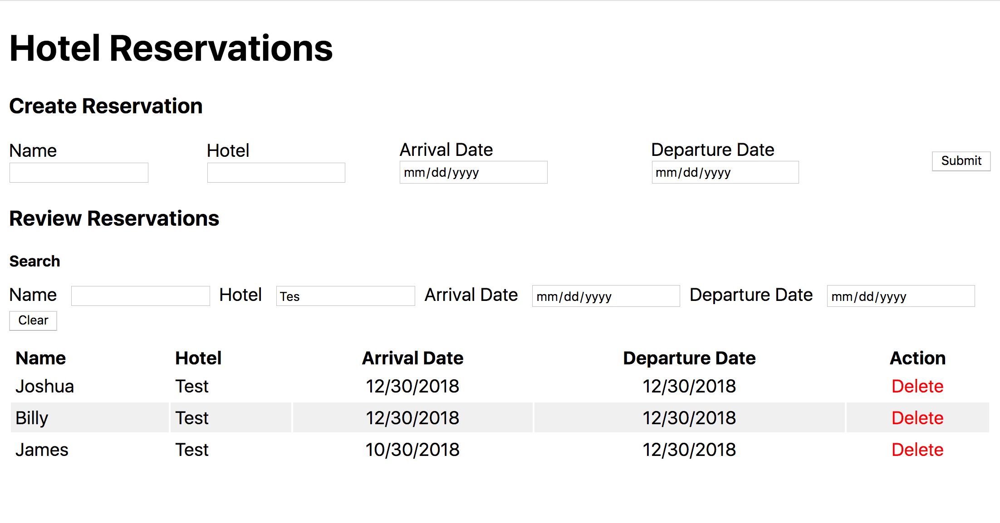

# Hotel Reservations

A simple app to create and review hotel reservations. Built with Node.js, MongoDB, React, GraphQL, and Apollo.

# Installation

1. Clone the repo.
2. Install the dependencies in both the `client` and the `server` folders (`npm install`).
3. Install and run MongoDB.
4. Copy the `.env.exampl` file in the `server` folder as `.env`, and add the required variables. (If you don't use port 8080, update the `client/src/constants.json` with the port you chose.)
5. Run the server in a terminal (`npm start` from the `server` folder).
6. Run the client in a terminal (`npm start` from the `client` folder).
7. Open `http://localhost:1234` in your browser.

